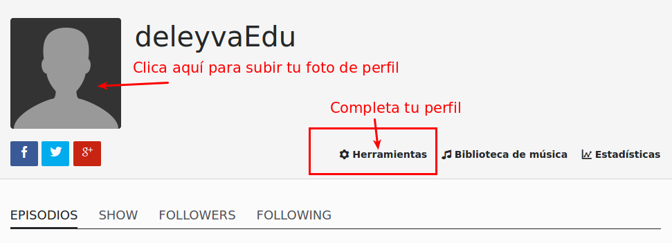

# Grabando y emitiendo nuestro programa

¡Manos a la obra! A continuación grabaremos nuestro primer programa utilizando [Spreaker](https://www.spreaker.com/). Esta sencilla aplicación facilita la labor de grabación y publicación de tus podcasts. ¡También puedes emitir en directo!

Lo primero que debemos hacer es darnos de alta.

Para registrarnos tenemos tres opciones: con nuestro usuario de redes sociales (Twitter o Facebook) o mediante nuestro mail. Si eliges esta última opción, no olvides revisar tu bandeja de entrada para verificar tu cuenta.

En la siguiente pantalla nos ofrecerá una ayuda sutil sobre cómo empezar.

Clicaremos en la opción para editar nuestro perfil.

## Recapitulemos

Tenemos algo que contar, hemos elaborado un guión, tenemos cuenta en Spreaker... ¡Vamos a grabar!
