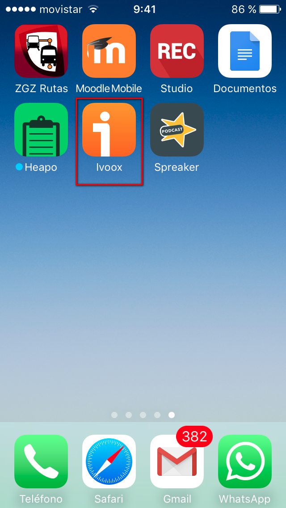
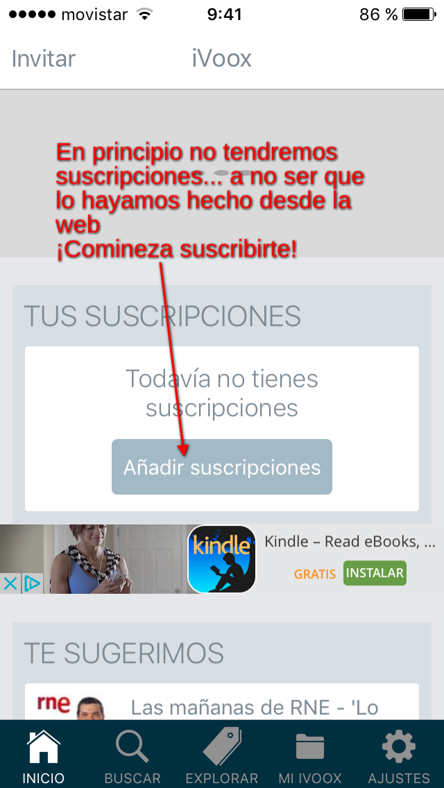
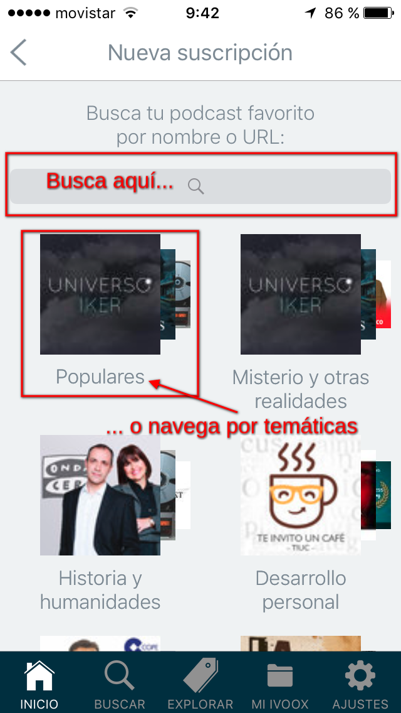
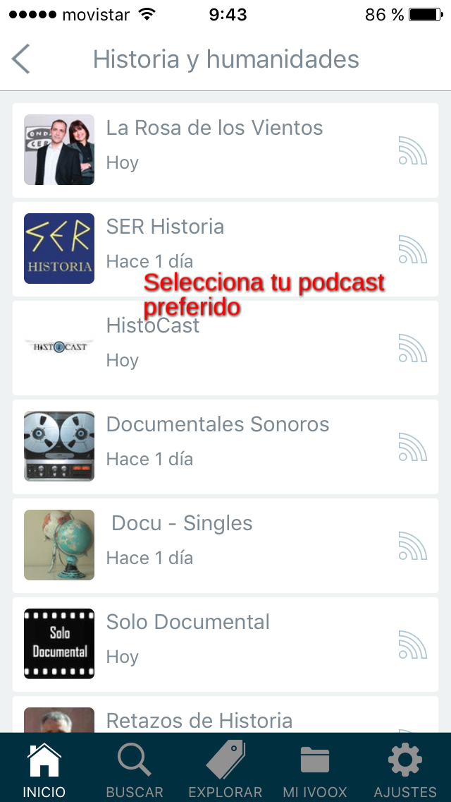
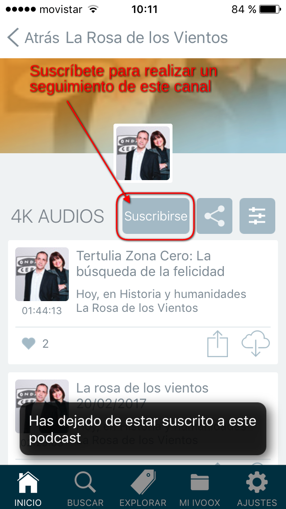
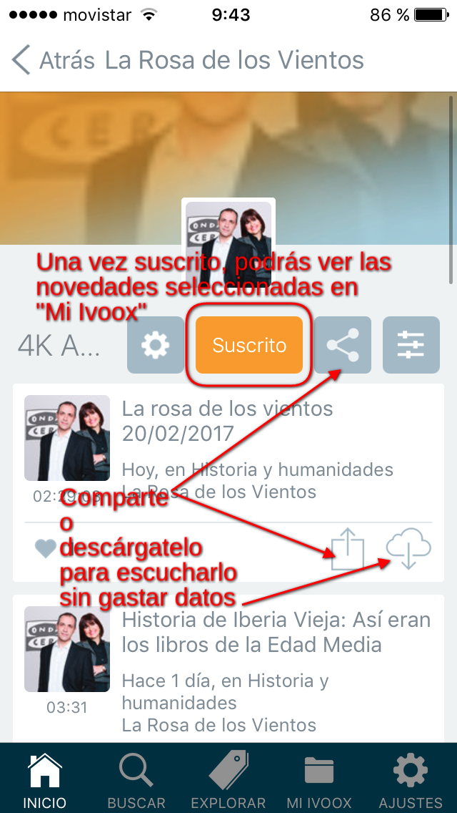
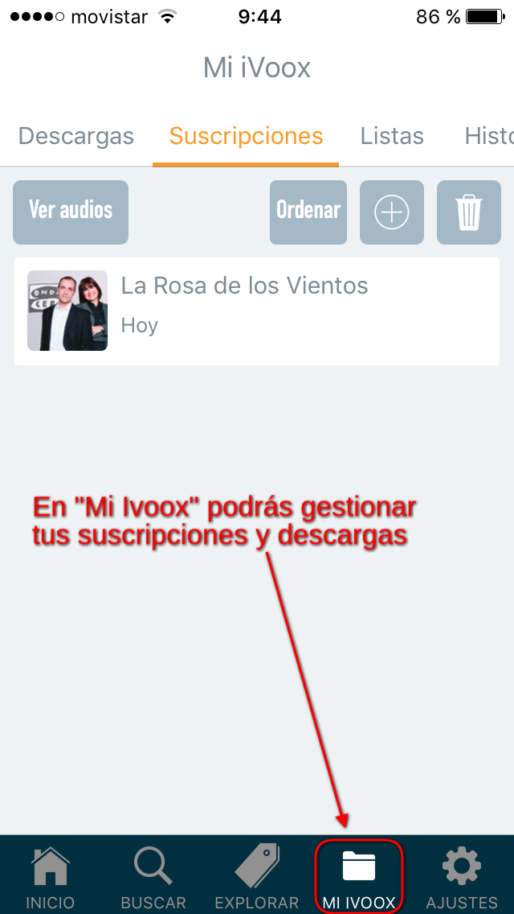
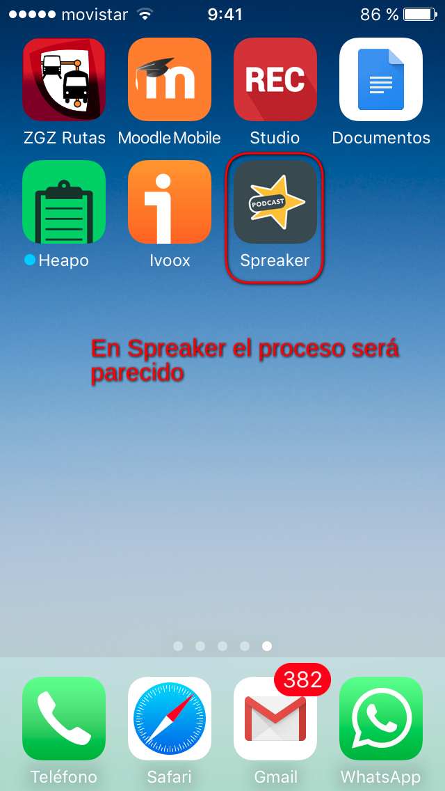
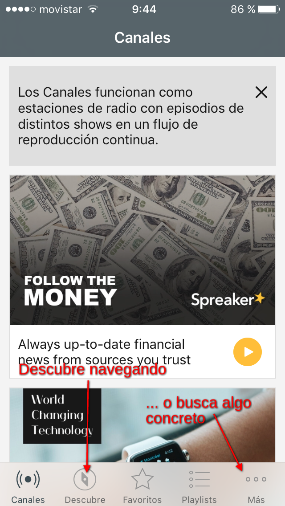
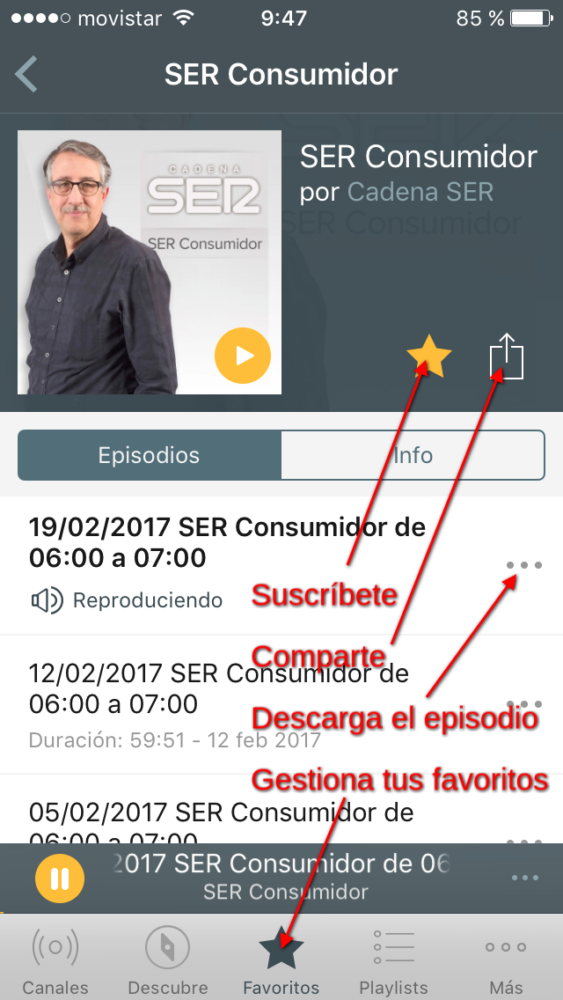

# ¡Publicamos!

En el siguiente vídeo veremos cómo:

<iframe width="700" height="400" src="//www.youtube.com/embed/L7cIhybsxag?rel=0" allowfullscreen="allowfullscreen" frameborder="0"></iframe>

[Jesús López de Leyva](https://www.youtube.com/channel/UCQm1zreJ9ysHoBat-BXr98w). [Licencia Atribución de Creative Commons (reutilización permitida)](https://www.youtube.com/t/creative_commons)

En la siguiente galería de imágenes podrás ver cómo suscribirte a podcasts desde tu aplicación móvil preferida. Para este ejemplo hemos tomado como referencia Spreaker e Ivoox.

Clica sobre la primera imagen y podrás ir avanzando usando las flechas que aparecen en los bordes.

## Galería de imágenes

