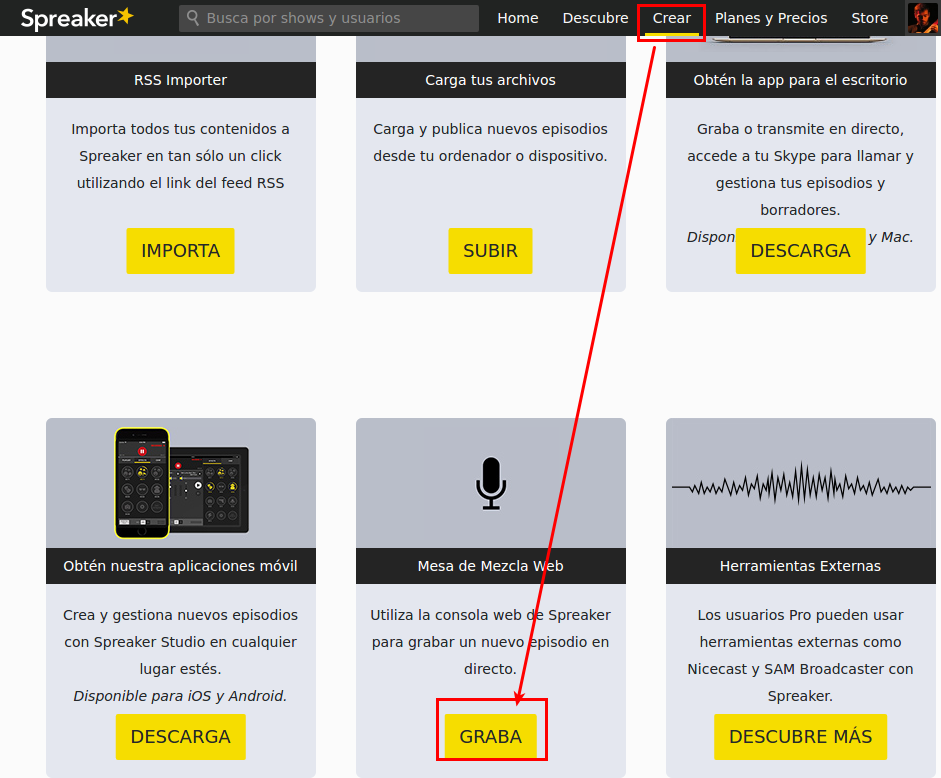

# ¿Y si usamos Linux?

Siempre podemos utilizar la grabadora web que ofrece Spreaker. Para esto necesitaremos tener conexión a internet. En el [siguiente vídeo](https://youtu.be/hqnyWwT_kNI) puedes ver cómo usarla. Para encontrar la opción a dicha consola, el camino es algo distinto al mostrado al inicio del vídeo.  Puedes verlo en la imagen que acompaña a este párrafo.

<iframe width="714" height="588" src="//www.youtube.com/embed/hqnyWwT_kNI" frameborder="0"></iframe>

[eoimarisa](https://www.youtube.com/channel/UChf1cohHciTAqKwjHEHuFdQ). [Licencia Youtube Estandar](https://www.youtube.com/t/terms?gl=MX&amp;hl=es-419)

## Grabando sin conexión a internet

Sin embargo, si queremos grabar nuestro podcast sin conexión a internet en Linux, el método de trabajo sería algo distinto a la hora de realizar nuestro programa. A no ser que tengamos una mesa de mezclas, deberemos dividir nuestro trabajo en dos pasos: grabación y edición. 

#### Grabación

Grabamos con nuestro dispositivo móvil o con nuestro ordenador utilizando [Audacity](http://www.audacityteam.org/). Si queremos grabar una llamada de Skype, podemos hacerlo utilizando [Skype Recorder](http://atdot.ch/scr/download/). También podemos realizar un Hangout en directo (ahora [Youtube Live](https://support.google.com/youtube/answer/7083786?hl=es)) y descargarnos después sólo el audio para editarlo. En la siguiente Lista de Reproducción tienes un curso muy completo sobre el uso de Audacity. Despliega el índice  para estudiar el aspecto que más te interese.

<iframe width="853" height="480" src="https://www.youtube.com/embed/aC_A4j6M6sY?list=PLLLaU95AMQPoKFG2ei-CN_b9rBXuetdcD" frameborder="0" allowfullscreen="allowfullscreen"></iframe>

[Videotutoriales Education](https://www.youtube.com/channel/UCSCm-WAc3eFhitDciUqLF5Q). [CC0 1.0 Universal (CC0 1.0) Public Domain Dedication](https://creativecommons.org/publicdomain/zero/1.0/)

#### Edición

El/los audios resultantes los editaremos con Audacity y los subiremos a los repositorios de podcasts que ya hemos comentado en la sección [¡Publicamos!](publicamos.html)

